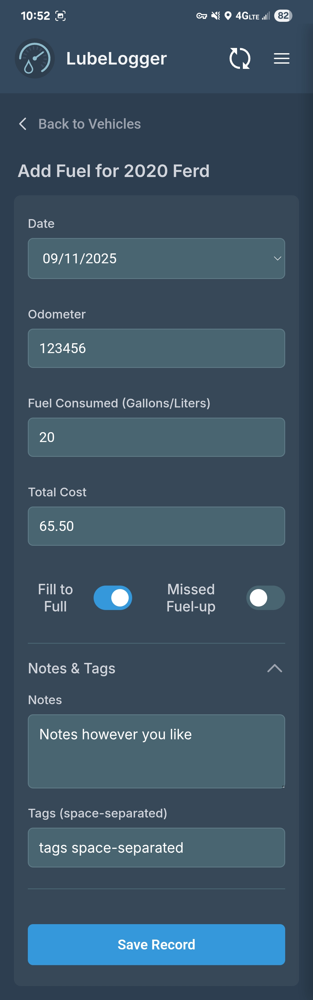

# lubelog-logger

PWA to push Fuel and Odometer Records to your LubeLogger server from your phone.

## Disclaimers

This app is designed specifically for use on mobile phones, and is not optimized for desktop use. It can certainly be used via desktop, the experience may just not be great.  
  

Keep in mind moving forward that, as the name suggests, I'm just a hobbyist. I'm not a professional web developer by any stretch, and I used LLMs pretty heavily in developing this. I do have a reasonable grasp on web development, but not the in-depth knowledge of CSS and HTML necessary to really make something polished and pretty.  
  
I'm not that familiar with GitHub, either, so don't be surprised when you see a thousand commits with small changes. It was the easiest way for me to test and save files since I work from a handful of different machines.
  
## Features

- Quick and easy entry of Fuel and Odometer records without opening the full website. 
- Optionally include notes and tags with entries.  
  
That's pretty much it, it's a simple app designed to do a simple task easily.

## Dependencies 

- This project is simply a frontend for two different components of [LubeLogger by hargata](https://github.com/hargata/lubelog). As such, this PWA requires you to have an instance of LubeLogger running somewhere in order to use.  

## Installation

For now, this will require manual installation, but there are plans in the future to make this a little easier. I'm not sure I want to get into Docker, especially considering it's just a PWA. 
  
1. Open your teminal of choice and navigate to the location at which you want to store the files (recommend `/var/www/` for the Linux users among us).

2. Run the following command to copy all files to a new folder:  
`git clone https://github.com/just-a-hobbyist/lubelog-logger.git`  
Feel free to rename the folder if you don't like the name.

3. Create a new `.conf` file:  
`sudo nano /etc/nginx/sites-available/lubelog-logger.conf`  
And fill out the following according to your setup:  
```
server {
    listen 80;
    # Replace with the domain or IP address you will use to access the PWA (e.g. your-sub-domain.duckdns.org)
    server_name pwa.your-domain.com; 

    # Set the root to the directory where you cloned the repository
    root /var/www/lubelog-logger;

    # Set the default file to serve
    index index.html;

    location / {
        try_files $uri $uri/ =404;
    }
}
```  

4. Save and exit the editor. Enable the site:  
`sudo ln -s /etc/nginx/sites-available/lubelog-logger.conf /etc/nginx/  sites-enabled/`

5. Test the nginx configuration:  
`sudo nginx -t`

6. If test is successful, reload nginx to apply changes:  
`sudo systemctl reload nginx`

7. If you are hosting the PWA and LubeLogger instance on different domains, you'll need to add a CORS header in your reverse proxy to your *LubeLogger Server* so that the PWA can talk to it.  
```
# Inside the Nginx config for your main LubeLogger server...
location / {
    # ... your other proxy_pass settings ...

    # IMPORTANT: Add this header, replacing the URL with your PWA's address
    add_header 'Access-Control-Allow-Origin' 'http://pwa.your-domain.com' always;
    
    # These headers are also recommended
    add_header 'Access-Control-Allow-Methods' 'GET, POST, OPTIONS' always;
    add_header 'Access-Control-Allow-Headers' 'Authorization, Content-Type' always;

    # Handle preflight requests
    if ($request_method = 'OPTIONS') {
        return 204;
    }
}
```  
8. Save the file, run `sudo nginx -t` and `sudo systemctl reload nginx` one more time to update the configuration. 

9. That's it, you should be able to run the app now. Navigate to the domain you set in the `lubelog-logger.conf` file to get started.

## Usage

Enter your domain, username, and password.  
  

  
The app will pull all vehicles associated with that username. To manually refresh the list if you want/need to, tap the refresh icon in the top right. To add a fuel or odometer record, tap one of your vehicles, then the button for whichever record you'd like to add.  
  

  
On the record entry page, fill out all necessary fields. To see Notes and Tags section, tap the "Notes & Tags" bar. Note: tags should be space-separated, just like they are on the native interface.  
  


When you're done, click "Save Record". The app will push the data to your server. If it does not succeed, the entry will be saved and is accessible under "Saved Entries", so you can try again later. After a successful submission, you'll be notified and taken back to the main vehicle list. 
 
Tap the "Back to Vehicles" button to go back to your vehicle list if you don't want to make an entry.  
  
To log out, tap the hamburger icon in the top right, then tap "Logout".  

 

You can also tap "Saved Entries" to view any entries which failed due to network issues. From that menu you can retry them individually or all together, or delete them entirely. 

This is also where you can check for updates to the app itself. The process is as follows: 
TODO 1. This needs work and updating

You can also set the auto-refresh interval. The default is 1 day. This is how often the app will refresh your vehicle list automatically when you open it. You may set it to 1, 3, or 7 days, or to never auto update. 
  
## Contributing 

If you feel so inclined, feel free to make pull/feature requests and bug reports. Just be aware that - again - I'm not particularly familiar with GitHub so I may not respond in a timely manner. Also keep in mind that this project is small, and is only really supposed to do two things: add fuel and odometer records. At this time I don't have much intention of taking it beyond that. Maybe if it gains a bunch of popularity I'll expand it more, but for now I don't see that being the case.  
  
## License 

This project is licensed under the [CC BY-NC-SA 4.0](LICENSE.txt) license.  


