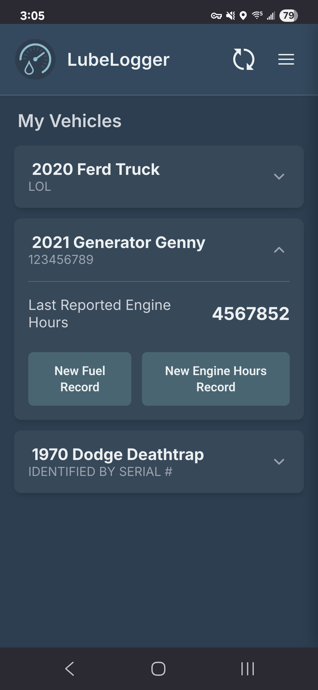
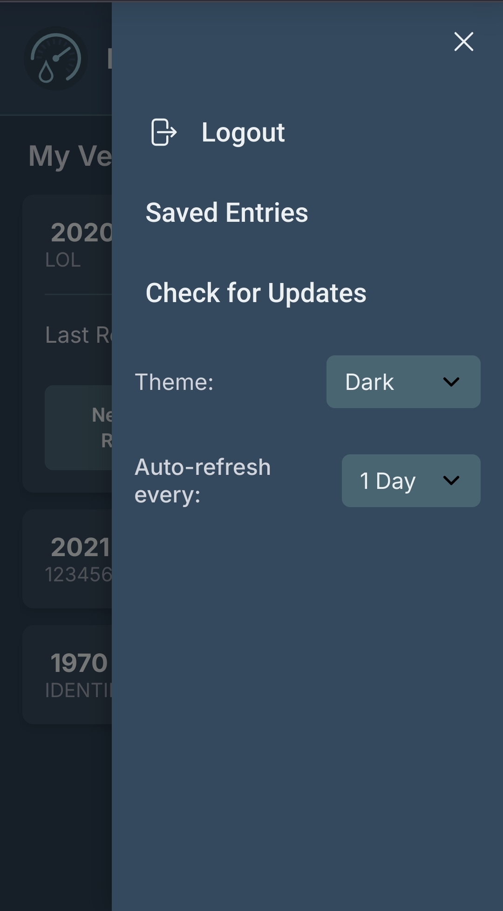

# lubelog-logger

PWA to push Fuel and Odometer Records to your LubeLogger server from your phone.

## Disclaimers

This app is designed specifically for use on mobile phones, and is not optimized for desktop use. It can certainly be used via desktop, the experience may just not be great.  
  
Keep in mind moving forward that, as the name suggests, I'm just a hobbyist. I'm not a professional web developer by any stretch, and I used LLMs pretty heavily in developing this. I do have a reasonable grasp on web development, but not the in-depth knowledge of CSS and HTML necessary to really make something polished and pretty.  
  
I'm not that familiar with GitHub, either, so don't be surprised when you see a thousand commits with small changes. It was the easiest way for me to test and save files since I work from a handful of different machines.
  
## Features

- Quick and easy entry of Fuel and Odometer records without opening the full website. 
- Optionally include notes and tags with entries.  
  
That's pretty much it, it's a simple app designed to do a simple task easily.

## Dependencies 

- This project is a frontend for two different components of [LubeLogger by hargata](https://github.com/hargata/lubelog). As such, this PWA requires you to have an instance of LubeLogger running somewhere in order to use.  
- If you want to self-host, you'll need git installed on your server to pull the app and any updates in the future. 

## Installation

There are a few options here, with the easiest (but potentially least secure) being to simply visit [the GitHub Page](https://just-a-hobbyist.github.io/lubelog-logger/) on your phone and login from there, or install as a PWA from there. That would allow easy updates and quick testing to see if you like the app, but it would also require you to open up CORS on your LubeLogger server to allow requests from my GitHub Page. The other option is to self-host the site on your own server, which requires using git and manually updating occasionally. I am exploring options to allow automatic updating, but haven't worked out the details yet - I'm not particularly interested in trying to learn docker or similar. Should you decide to go the self-hosted route, here are the instructions: 
  
1. Open your teminal of choice and navigate to the location at which you want to store the files (recommend `/var/www/` for the Linux users among us).

2. Run the following command to copy all files to a new folder:  
`git clone https://github.com/just-a-hobbyist/lubelog-logger.git`  
Feel free to rename the folder if you don't like the name.

3. Create a new `.conf` file:  
`sudo nano /etc/nginx/sites-available/lubelog-logger.conf`  
And fill out the following according to your setup:  
```
server {
    listen 80;
    # Replace with the domain or IP address you will use to access the PWA (e.g. your-sub-domain.duckdns.org)
    server_name pwa.your-domain.com; 

    # Set the root to the directory where you cloned the repository
    root /var/www/lubelog-logger;

    # Set the default file to serve
    index index.html;

    # If you're going to be hosting this from the root domain, just use "location /", but if you're going to be hosting from something like domain.com/lubelog-logger, you'll need to set location to "/lubelog-logger/"
    location / {
        try_files $uri $uri/ =404;
    }
}
```  

4. Save and exit the editor. Enable the site:  
`sudo ln -s /etc/nginx/sites-available/lubelog-logger.conf /etc/nginx/  sites-enabled/`

5. Test the nginx configuration:  
`sudo nginx -t`

6. If test is successful, reload nginx to apply changes:  
`sudo systemctl reload nginx`

7. If you are hosting the PWA and LubeLogger instance on different domains, you'll need to add a CORS header in your reverse proxy to your *LubeLogger Server* so that the PWA can talk to it.  
```
# Inside the Nginx config for your main LubeLogger server...
location / {
    # ... your other proxy_pass settings ...

    # IMPORTANT: Add this header, replacing the URL with your PWA's address
    add_header 'Access-Control-Allow-Origin' 'http://pwa.your-domain.com' always;
    
    # These headers are also recommended
    add_header 'Access-Control-Allow-Methods' 'GET, POST, OPTIONS' always;
    add_header 'Access-Control-Allow-Headers' 'Authorization, Content-Type' always;

    # Handle preflight requests
    if ($request_method = 'OPTIONS') {
        return 204;
    }
}
```  
8. Save the file, run `sudo nginx -t` and `sudo systemctl reload nginx` one more time to update the configuration. 

9. **Important!!!** Lubelogger authentication via the API currently uses Basic Auth based on RFC2617, which means that your username and password are encoded, but **not encrypted**, in *storage or transit*! To protect yourself and your computer, use a strong, unique password, and use **only** https if you want to make your instance accessible from outside your local network. To set up https, do the following if using nginx: `sudo apt install certbot`, then `sudo certbot --nginx`. This will make certbot automatically find and create all the necessary certs and changes to your nginx `.conf` file. 

10. That's it, you should be able to run the app now. Navigate to the domain you set in the `lubelog-logger.conf` file to get started. If you want to install it as a PWA on your phone rather than use it as a website, you can do so using whatever method with which PWAs are normally installed on your device. For instance, Chrome and Firefox usually have an option to "Add to Home screen" or similar in the 3-dot menu on the webpage. This allows you to use and manage it like any other app on your device, so you can clear the cache, uninstall it, set permissions, etc.

## Usage

Enter your domain, username, and password. Domain should be an IP address only if you are using it strictly on a local network, otherwise use a domain with https. 
  

  
The app will pull all vehicles associated with that username. To manually refresh the list if you want/need to, tap the refresh icon in the top right. The list can also be automatically refreshed after 1, 3, or 7 days, or never - as decided by the user in the side menu bar. Vehicles are identified by their license plate by default, but if you have enabled custom fields for the vehicle and set the identifier in LubeLogger to be a custom field (like a serial number or VIN) it will use that same identifier here. To add a fuel or odometer/hour record, tap one of your vehicles, then the button for whichever record you'd like to add.  
  

  
On the record entry page, fill out all necessary fields. To see Notes and Tags section, tap the "Notes & Tags" bar. Note: tags should be space-separated, just like they are on the native interface. If you have set the vehicle to be "odometer optional" it will not be required in fuel entries, but will be required in odometer/hour entries.  
  


When you're done, click "Save Record". The app will push the data to your server. If it does not succeed due to network failure, the entry will be saved and is accessible under "Saved Entries", so you can try again later. After a successful submission, you'll be notified and taken back to the main vehicle list. 
 
Tap the "Back to Vehicles" button to go back to your vehicle list if you don't want to make an entry.  
  
To log out, tap the hamburger icon in the top right, then tap "Logout". The app will save the last domain entered in the domain field.  

 

From this menu you can also tap "Saved Entries" to view any entries which failed due to network issues. From that page you can retry them individually or all together, or delete them entirely. 
 
You can also select from a few different themes here. The default is dark as seen in the screenshots, and there is also a light mode and an "OG Dark" which attempts to emulate the colors of LubeLogger's dark theme. 

This is also where you can check for updates to the app itself. The process is as follows: 
 
1. Open the side menu and tap "Check for Updates" 
2. If there is a new version on GitHub, you will be notified that an update is available. 
3. Navigate on your server to the location you to which you pulled the repository and run `git pull origin main` to download all the latest files.
4. Tap "Check for Updates" again, and the app will find new files, and prompt you with a toast notification to reload the app. Tap the button to reload and the new version will be downloaded and installed.

You can also set the auto-refresh interval from the menu bar.
  
## Contributing 

If you feel so inclined, feel free to make pull/feature requests and bug reports. Just be aware that - again - I'm not particularly familiar with GitHub so I may not respond in a timely manner. Also keep in mind that this project is small, and is only really supposed to do two things: add fuel and odometer records. At this time I don't have much intention of taking it beyond that. Maybe if it gains a bunch of popularity I'll expand it more, but for now I don't see that being the case.  
  
## License 

This project is licensed under the [CC BY-NC-SA 4.0](LICENSE.txt) license.  


